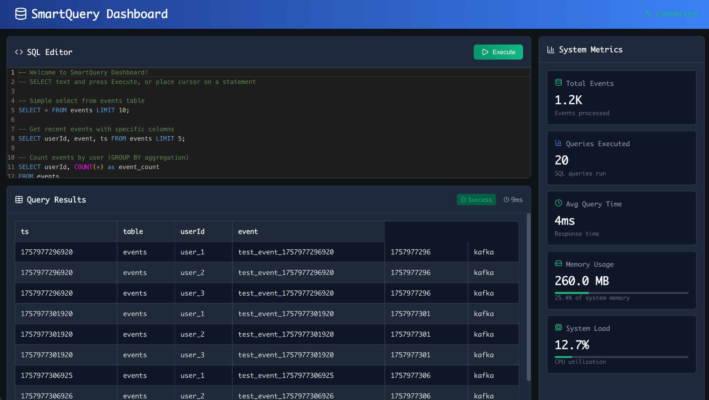

# SmartQueryDB

SmartQueryDB is a lightweight analytics engine written in Java that ingests streaming event data, stores it in a columnar format, and supports SQL-like queries with filtering, grouping, ordering, and aggregation. It features **adaptive ML-driven indexing** that learns from query patterns to automatically build/drop indexes, and it exposes **system metrics** for full observability.

## Features
- **Streaming ingestion** from HTTP, Kafka, or a synthetic data generator
- **Columnar storage** with flushable segments and simple compaction
- **SQL support**: `SELECT`, `WHERE`, `GROUP BY`, `ORDER BY`, `LIMIT`, and common aggregates
- **Adaptive indexing** (bitmap and B-tree) guided by workload statistics
- **Metrics & observability**: ingest throughput, query latency, memory, CPU
- **Console REPL** for running queries interactively
- **Dashboard** for running SQL and visualizing system metrics

## Screenshot

### Dashboard

